# AP Investigation Analyst Copilot

This project is a Streamlit prototype for accounts-payable investigation analysts. An analyst can ask questions such as "Which vendors have overdue invoices greater than INR 1,00,000?", "Show all invoices for Engineering", or "Who are our top 5 vendors?" and the app translates the request into governed SQLite SQL, executes it, explains the result, asks clarifying questions when the business meaning is ambiguous, and records benchmark evidence.

The product framing is an AP investigation workflow, not a generic SQL chatbot:

- identify overdue, unpaid, or high-value invoices
- investigate vendor exposure and watchlist status
- trace spend through purchase orders, departments, products, and payments
- compare AP volume across periods
- produce analyst-friendly explanations, charts, and audit records

## Architecture

```mermaid
flowchart LR
    A["AP analyst question"] --> B["Streamlit chat"]
    B --> C["LangGraph thread memory"]
    C --> D["Standalone question resolver"]
    D --> E["Semantic cache lookup"]
    E -->|hit| F["Cached structured response"]
    E -->|miss| G["Semantic router"]
    G --> H["Selected AP tables and metrics"]
    H --> I["Bridge-table expansion"]
    I --> J["Clarification gate"]
    J -->|ambiguous| K["Clarifying question"]
    J -->|clear| L["Focused semantic context"]
    L --> M["SQL generation prompt"]
    M --> N["Structured JSON response"]
    N --> O["SQL guardrails"]
    O --> P["SQLite validation and execution"]
    P --> Q["Result table"]
    P --> R["Chart planning agent"]
    R --> S["Plotly chart"]
```



The pipeline is split into deterministic and model-assisted steps:

1. **Question resolver**: rewrites follow-ups like "now break that down by department" into standalone AP questions.
2. **Router**: selects relevant semantic-layer tables and metrics instead of exposing the full schema.
3. **Context builder**: expands required bridge tables, such as `purchase_orders` between `invoices` and `departments`.
4. **Clarification gate**: asks before guessing when the analyst's wording changes the business answer.
5. **SQL generator**: returns strict JSON with SQL, explanation, assumptions, follow-up question, and chart hint.
6. **SQL runner**: validates read-only SQL and executes it against SQLite.
7. **Chart agent**: plans and renders a Plotly chart when the result shape supports one.

## Setup

This project uses Python 3.11+ and `uv`.

```bash
uv sync
```

Create a `.env` file in the repo root. Start from `.env.example`:

```bash
GEMINI_API_KEY=your_gemini_api_key
LANGFUSE_SECRET_KEY=
LANGFUSE_PUBLIC_KEY=
LANGFUSE_BASE_URL=https://cloud.langfuse.com
NL_TO_SQL_CACHE_EMBEDDINGS=async
NL_TO_SQL_CACHE_EMBEDDING_DELAY_SECONDS=1
```

Run the app:

```bash
uv run streamlit run streamlit_app.py
```

Then open the local Streamlit URL shown in the terminal. The first semantic-cache write or lookup may download the `BAAI/bge-small-en-v1.5` embedding model through `sentence-transformers`.

## Model Configuration

The prototype defaults to `gemini-3-flash-preview` for SQL generation, chart planning, semantic-layer creation, and optional analysis synthesis. SQL generation uses deterministic model parameters in code:

| Setting | Current value | Purpose |
| --- | --- | --- |
| Model | `gemini-3-flash-preview` | Fast NL-to-SQL and analysis generation for the prototype. |
| Temperature | `0` | Reduce variation across benchmark runs. |
| Top-p | `0.1` | Keep generations focused on the supplied semantic context. |
| API key | `GEMINI_API_KEY` | Required for live chat, benchmark suite runs, chart planning, and semantic-layer regeneration. |
| Langfuse | `LANGFUSE_*` | Optional tracing; the app continues without it. |
| Cache embeddings | `NL_TO_SQL_CACHE_EMBEDDINGS` | `async` by default; set to `false`, `0`, `off`, or `disabled` to avoid embedding backfill. |

## No-Key Demo Path

Without `GEMINI_API_KEY`, reviewers can still inspect and validate the non-AI portions:

```bash
uv sync
uv run python -m unittest discover -s tests -v
```

The deterministic tests use mocks where model calls would otherwise be required. They validate clarification handling, SQL-response normalization, bridge-table expansion, benchmark storage, dashboard rendering, cache-skip behavior for ambiguous questions, SQL validation helpers, and a mocked clarification-to-SQL flow.

Live chat, fixed benchmark execution, chart planning, and semantic-layer regeneration require `GEMINI_API_KEY`.

## Running Tests

Run deterministic tests:

```bash
uv run python -m unittest discover -s tests -v
```

Current deterministic status:

```text
Ran 30 tests
OK
```

These tests do not call Gemini for every benchmark question. They verify the deterministic control flow around clarification attempts, no-default ambiguity rules, cache skipping for ambiguous questions, bridge-table expansion, executable-SQL detection, benchmark storage, dashboard generation, and a mocked clarification-to-SQL flow that executes against SQLite.

## Evaluation and Benchmarking

The Streamlit **Benchmark** tab runs a fixed AP investigation suite from `src/benchmark_store.py` as `BENCHMARK_QUESTIONS`.

Run the benchmark:

1. Start the app with `uv run streamlit run streamlit_app.py`.
2. Open the **Benchmark** tab.
3. Click **Run fixed benchmark suite**.
4. Review the generated dashboard and recent run records.

Each benchmark run is append-only and records question, expected capability, category, model name, latency, clarification behavior, SQL generation and execution status, result row count, cache hit/strategy, selected tables and metrics, generated SQL, chart status, and raw structured model output.

Runtime benchmark files are ignored by git so reviewers can generate fresh evidence:

| Artifact | Purpose |
| --- | --- |
| `data/benchmark_results.db` | Local append-only benchmark database generated at runtime. |
| `data/benchmark_dashboard.html` | Local HTML benchmark dashboard generated at runtime. |

### Fixed Benchmark Questions

| Category | Analyst question | Expected behavior |
| --- | --- | --- |
| Simple | How many invoices were raised last month? | Count invoices with a last-month date filter. |
| Simple | List all vendors on the watchlist. | Filter vendors where `is_watchlist = 1`. |
| Joins | Which vendors have overdue invoices greater than INR 1,00,000? | Join invoices to vendors, filter unpaid overdue invoices above 100000. |
| Joins | Show me all invoices for the Engineering department. | Join invoices to purchase orders to departments. |
| Aggregation | What is the total outstanding amount across all vendors? | Aggregate unpaid invoice value. |
| Aggregation | Which product has the highest total invoiced value? | Join invoice line items to products and rank by value. |
| Window | Rank vendors by total invoice value. | Use ranking over vendor-level invoice totals. |
| Window | For each vendor, show the running total of payments received. | Use `SUM(...) OVER (PARTITION BY vendor ORDER BY payment_date)`. |
| Window | Show each invoice alongside the previous invoice amount for the same vendor. | Use `LAG(...) OVER (PARTITION BY vendor ORDER BY invoice_date)`. |
| Metric | What was our revenue last quarter? | Use the `revenue` metric: paid invoice `grand_total` in the previous quarter. |
| Synonym | Show me all unpaid bills. | Resolve bills to invoices and unpaid to non-paid invoice statuses. |
| Ambiguity | Who are our top 5 vendors? | Ask whether top means invoice value, invoice count, payment value, or rating. |
| Temporal | Compare this quarter's invoice volume with last quarter. | Compare invoice counts for current and previous calendar quarters. |

### Manual Verification Snapshot

The latest manual verification focused on cases that previously exposed semantic-layer or bridge-table risk:

| Question | Observed behavior |
| --- | --- |
| Show me all invoices for the Engineering department. | Generated SQL using `invoices -> purchase_orders -> departments`; executed successfully. |
| For each vendor, show the running total of payments received. | Generated SQL using `vendors -> invoices -> payments` with a window function; executed successfully. |
| What was our revenue last quarter? | Generated SQL from the `revenue` metric and previous-quarter date logic; executed successfully. |
| Who are our top 5 vendors? | Returned a clarification question instead of guessing. |

### Non-AI Baseline Comparison

| Approach | What it can handle | Where it fails for AP investigations | Prototype response |
| --- | --- | --- | --- |
| Hand-written SQL templates | Known reports such as overdue invoices by vendor. | Cannot adapt to new combinations of vendor, department, payment, product, and period filters without adding templates. | LLM composes SQL over a semantic layer and join-path hints. |
| Keyword-to-table rules | Simple terms like "vendor" or "invoice". | Misses synonyms such as "bills", misunderstands metrics like "revenue", and cannot reliably decide when clarification is required. | Router, metric definitions, synonyms, and clarification rules combine deterministic metadata with model reasoning. |
| Dashboard filters only | Repeatable operational slices. | Analysts still need ad hoc joins, temporal comparisons, and investigation follow-ups. | Chat memory resolves follow-ups and generates query-specific SQL. |
| Full-schema prompt only | Broad schema visibility. | Increases prompt noise and encourages wrong joins or irrelevant columns. | Focused semantic context plus bridge-table expansion narrows the prompt. |

## Semantic Layer

The semantic layer includes:

- table and column descriptions for the AP database
- business synonyms, enum values, and filter hints
- direct relationships and multi-hop join paths
- named metrics such as revenue and outstanding amount
- ambiguity rules for questions like "top vendors"
- query hints for rankings, running totals, previous-row comparisons, three-way match, and budget utilization

The cache is scoped by a hash of `data/semantic_layer.json`; SQL generated against an older semantic layer is not reused after the semantic layer changes.

## SQL Safety

Before a generated query is executed, `src/02_run_sql_on_sqlite.py`:

- rejects non-read queries unless they start with `SELECT` or `WITH`
- parses SQL before execution and allows one read-only statement
- blocks write operations through SQL validation and SQLite authorization
- validates that referenced tables exist in the database
- runs `EXPLAIN QUERY PLAN`
- applies query timeout and result-row limits
- catches SQLite errors and returns readable errors

This is a prototype boundary. A production deployment should additionally use warehouse-level read-only credentials, query-cost controls, audited access policies, and stronger input guardrails.

## Known Limitations

- The semantic layer was generated from schema metadata and should be reviewed by AP domain owners before production use.
- Prompt behavior remains model-dependent even with low-temperature settings.
- The deterministic tests cover control flow; a larger golden-query suite with expected SQL patterns and result assertions would be required for production readiness.
- SQL validation is still a prototype guardrail and should be hardened against the target production warehouse dialect.
- SQLite does not provide the same read-only user model as production warehouses.
- LangGraph memory currently uses in-process checkpoints, while chat history is stored locally.

## Reflection

See `REFLECTION.md` for the design rationale, why AI is necessary for the AP investigation workflow, why rule-only systems break down, architecture tradeoffs, evaluation results, failure cases, and changes made after testing.
