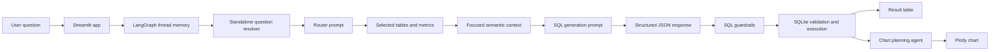

# Semantic Layer for NL-to-SQL on an AP Database

## Architecture



## What Is Implemented

### Semantic Layer

LLM created semantic layer that takes database schema as input and creates semantic layer json. Prompt is designed to be universal and it can work for any database connected and not just this particular database.

### NLP-to-SQL Pipeline

The core NL-to-SQL flow is intentionally split into focused LLM calls:

1. **Question resolver call for follow-ups** - rewrites a conversational follow-up into a standalone business question using LangGraph thread memory.
2. **Router call** - selects only the relevant tables and metrics from the semantic layer.
3. **SQL generation call** - receives a smaller focused context and generates JSON containing SQL, explanation, assumptions, follow-up questions, and chart hint.

This keeps the SQL prompt smaller, cheaper, and less likely to mix unrelated schema details.

### Multi-Turn Follow-Ups

The LangGraph pipeline now uses thread-scoped in-memory checkpoints. Streamlit creates one `thread_id` per browser session, so users can ask follow-up questions like "now break that down by department" without mixing context across sessions.

Each turn stores a compact memory record containing the original question, resolved standalone question, selected tables and metrics, generated SQL, assumptions, chart hint, clarifying question text, and a small SQL execution summary. Before routing a follow-up, a resolver node rewrites the latest user message into a complete standalone question using only that thread's recent memory.

### Langfuse Tracing

Streamlit creates a deterministic Langfuse trace id from the conversation `thread_id`, so every turn in the same chat is written to one Langfuse trace. The trace contains named observations for the conversation turn, LangGraph nodes, Gemini calls, SQLite execution, and chart planning. Root turn observations include the user question as input and the generated SQL output, SQL execution summary, and chart details as output.

See sample trace: [sample trace](https://cloud.langfuse.com/project/cmoy8uw0u01x4ad08i1fekkuu/traces/47d9eb3322380fde86b86a2aeb4e8686?timestamp=2026-05-09T11%3A26%3A05.016Z&observation=67e8f238dc3543d4)

### Persistent Chat History

The app stores chats in a local SQLite database at `data/chat_history.db`. Each chat is named from the first user question, and the sidebar can load saved chats later. The database stores user messages, assistant outputs, chart JSON, and the compact conversation memory snapshot used to rehydrate follow-up context after loading a previous chat.

### SQL Safety and Validation

Before execution, generated SQL passes through guardrails:

- removes comments and string literals before safety scanning
- blocks `INSERT`, `UPDATE`, and `DELETE`
- validates that referenced tables exist in SQLite
- runs `EXPLAIN QUERY PLAN` before executing
- catches SQLite errors and returns a readable failure message

This does not make arbitrary LLM SQL fully production-safe, but it creates a clear execution boundary for the prototype.

### Visualization

After SQL execution, a chart agent inspects the question, SQL chart hint, and result shape. It chooses one of:

- bar chart
- line chart
- pie chart
- scatter chart
- none

The chart plan is validated against actual result columns before Plotly renders anything.

## Setup

This project uses Python 3.11+ and `uv`.

```bash
uv sync
```

Create a `.env` file in the repo root:

```bash
GEMINI_API_KEY=your_api_key_here
LANGFUSE_SECRET_KEY=your_langfuse_secret_key
LANGFUSE_PUBLIC_KEY=your_langfuse_public_key
LANGFUSE_BASE_URL=https://cloud.langfuse.com
```

Run the Streamlit app:

```bash
uv run streamlit run streamlit_app.py
```

Then open the local Streamlit URL shown in the terminal.


## Design Decisions

### SQLite

I used SQLite because it keeps the project easy to run locally. It also makes validation straightforward with `EXPLAIN QUERY PLAN` and avoids requiring a separate database server for review.

### Focused Context Instead of Full Schema Dump

The router step reduces the semantic layer to only relevant tables, metrics, join paths, identity columns, ambiguity rules, and query hints. This is more production-friendly than always sending the full schema because it reduces prompt size and lowers the chance of irrelevant joins.

### Structured Model Output

The model is required to return JSON with fixed fields. This makes the UI and execution path deterministic enough for a prototype: SQL can be extracted, assumptions can be displayed, follow-up questions can be surfaced, and chart hints can be passed to the chart agent.

### Guardrails at the Execution Boundary

The SQL runner owns validation. That way, even if another UI or script calls `run_query()`, the same write-operation block and table validation still apply.

## Known Limitations

- The semantic layer was generated from schema metadata and then used as a prototype artifact. In a real implementation, human should review metric definitions and synonyms.
- The write guardrail blocks obvious mutation statements, but production systems should use a read-only database user, query timeouts, row limits, and a proper SQL parser.
- Temporal phrases depend on SQLite `date('now')`, so test results vary with the current date.
- Chat transcripts are persisted locally in `data/chat_history.db`, but LangGraph's live checkpoint is rehydrated from a compact memory snapshot rather than using a full persistent checkpointer.

## What I Would Improve With More Time

- Add an evaluation harness with 30-50 natural-language questions, expected SQL patterns, and result assertions.
- Replace regex table extraction with a real SQL parser such as `sqlglot`.
- Add a query cache keyed by normalized question plus selected semantic-layer context.
- Add durable multi-user memory backed by a persistent LangGraph checkpointer.
- Add a review UI for editing the generated semantic layer manually.
- Run the database through a read-only connection with timeouts and row limits.
- Add CI checks for prompt JSON parsing, SQL validation, and a few deterministic non-LLM runner tests.

## AI Tools Used

I used AI tools transparently during development:

- Used Gemini APP for intial code writing. 
- GitHub Copilot was used for inline completions and small bug fixes while writing Python code.
- Codex was used after intial wroking app was ready. For e.g., logger implementation, streamlit app, LangGraph migration etc...

I treated AI output as a draft, then tested and adjusted the project around concrete code paths, prompts, and SQLite execution behavior.
