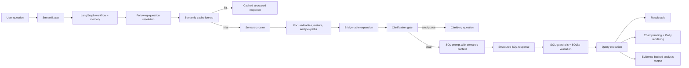

# Semantic-Layer Investigation Copilot

A semantic-layer-driven AI system that turns ambiguous business questions into governed SQL, executes them safely, and returns analyst-friendly answers with evidence, visualizations, and evaluation artifacts.

This project is built as a working product, not just a prompt demo. It combines a multi-step LLM workflow, semantic context retrieval, clarification handling, SQL guardrails, benchmark tracking, and dataset onboarding in a single Streamlit application.

The bundled sample dataset is a finance / operations-style dataset used to demonstrate the workflow. The implementation is intentionally designed so the same system can be adapted to other SQLite datasets through the onboarding flow and semantic-layer tooling.

## Why this project is relevant

This repo demonstrates the kind of end-to-end applied AI work that goes beyond calling an LLM once:

- framing an ambiguous user question into a structured workflow
- retrieving focused semantic context instead of prompting over the full schema
- asking clarifying questions when the business meaning is ambiguous
- generating and validating read-only SQL before execution
- producing charts and higher-level analysis from the result
- capturing feedback, certified questions, benchmark runs, and local evaluation data
- supporting onboarding of new datasets instead of staying locked to one demo schema

In short: this is an AI-native investigation system with product, architecture, evaluation, and safety layers.

## What the product does

A user can ask questions such as:

- "Which vendors have overdue invoices greater than INR 1,00,000?"
- "Show all invoices for the Engineering department."
- "Who are our top 5 vendors?"
- "Compare this quarter's invoice volume with last quarter."
- "For each vendor, show the running total of payments received."

The system can then:

1. resolve follow-up questions using conversation memory
2. retrieve a focused subset of semantic metadata
3. detect ambiguity and ask a clarification instead of guessing
4. generate structured SQL output
5. validate and execute read-only SQL on SQLite
6. explain the result in a business-friendly format
7. render a chart when the result shape supports it
8. store benchmark and feedback artifacts for later review

## Product surfaces

The Streamlit app includes more than a single chat screen. It currently supports:

- `Investigation` chat
- `Certified Questions`
- `Dataset Onboarding`
- `Data Settings`
- `Business Glossary`
- `Corrections`
- `Benchmark`

That matters because the project is designed as an operational workflow, not only as a text-to-SQL demo.

## System architecture



## Core technical ideas

### 1. Semantic-layer-first query generation

Instead of exposing the full raw schema to the model on every request, the pipeline narrows the prompt to the most relevant tables, metrics, join paths, business synonyms, and ambiguity rules.

This improves controllability, reduces prompt noise, and makes failures easier to inspect.

### 2. Clarification before confident but wrong answers

If the wording materially changes the business answer, the system asks a follow-up instead of guessing.

Example: a question like "top vendors" may refer to invoice value, invoice count, payment value, outstanding amount, or rating. The system treats that as a business ambiguity, not as a free prompt-completion opportunity.

### 3. Deterministic bridge-table expansion

One common NL-to-SQL failure mode is selecting the right endpoints but missing the actual join bridge. This project includes deterministic bridge-table expansion so the system can add required intermediate tables when building the SQL context.

### 4. Structured outputs, not free-form SQL text

The SQL generation step returns structured JSON fields such as:

- SQL
- explanation
- assumptions
- follow-up question
- chart hint
- clarification state

That structure makes downstream UI rendering, testing, normalization, caching, and benchmarking more reliable.

### 5. SQL safety as a real system boundary

Before SQL is executed, the runner validates that the query is read-only and safe to run against the local SQLite database.

Current safeguards include:

- parser-backed validation with `sqlglot`
- single-statement enforcement
- read-only query enforcement
- SQLite authorizer restrictions
- table existence checks
- query-plan inspection
- query timeout handling
- result row caps

This is still a prototype boundary, but it is intentionally much stronger than relying on prompt instructions alone.

### 6. Evaluation and feedback loops

The app stores benchmark runs and can generate a local dashboard from them. It also supports:

- certified question templates
- analyst feedback capture
- semantic corrections
- deterministic offline evaluation cases

That closes the loop between generation quality and operational learning.

### 7. Dataset onboarding beyond the bundled sample

The project is not limited to the included sample dataset. It contains a dataset onboarding flow that can:

- inspect a new SQLite database
- infer schema details and join candidates
- identify likely metrics and sensitive columns
- generate a semantic-layer draft with LLM assistance
- publish an updated semantic layer for the app

This is one of the main reasons I would position the project as a reusable investigation framework demonstrated on a sample finance / operations dataset, not as a one-off domain-specific chatbot.

## Tech stack

- `Python 3.11+`
- `Streamlit` for the UI
- `LangGraph` for the multi-step workflow and memory checkpoints
- `Google Gemini` for generation
- `Plotly` for charts
- `sqlglot` for SQL parsing / validation
- `sentence-transformers` for semantic cache embeddings
- `Langfuse` for optional tracing
- `SQLite` for the sample data and local app stores

## Repository structure

- `streamlit_app.py` — main application shell and UI flows
- `src/pipeline.py` — LangGraph-based NL-to-SQL workflow
- `src/analysis_workflow.py` — evidence-backed analysis layer built on top of SQL generation
- `src/pipeline_semantic_context.py` — semantic routing, join-path expansion, ambiguity handling, and SQL context construction
- `src/02_run_sql_on_sqlite.py` — SQL validation and guarded execution
- `src/chart_agent.py` — chart planning and Plotly rendering
- `src/cache_store.py` — semantic cache logic
- `src/dataset_onboarding.py` — onboarding flow for new SQLite datasets
- `src/eval.py` — deterministic offline baseline evaluation
- `tests/` — automated test suite

## Running locally

### Prerequisites

- Python `3.11+`
- [`uv`](https://github.com/astral-sh/uv)
- a Gemini API key for live model-backed features

### Install dependencies

```/dev/null/install.sh#L1-1
uv sync
```

### Configure environment

Start from `.env.example` and create `.env` in the repo root.

Required for live chat and model-backed features:

```/dev/null/env.example#L1-6
GEMINI_API_KEY=your_gemini_api_key
LANGFUSE_SECRET_KEY=
LANGFUSE_PUBLIC_KEY=
LANGFUSE_BASE_URL=https://cloud.langfuse.com
NL_TO_SQL_CACHE_EMBEDDINGS=async
NL_TO_SQL_CACHE_EMBEDDING_DELAY_SECONDS=1
```

### Run the app

```/dev/null/run.sh#L1-1
uv run streamlit run streamlit_app.py
```

Then open the local Streamlit URL shown in the terminal.

## No-key review path

If you want to review the deterministic parts of the system without setting up a model key, you can still install dependencies and run the test suite.

```/dev/null/test.sh#L1-1
uv run python -m unittest discover -s tests -v
```

Verified in this environment:

- `75` tests passed
- runtime was approximately `7.7s`

These tests cover a meaningful portion of the non-trivial system behavior, including:

- clarification handling
- ambiguity rules
- bridge-table expansion
- answer modes
- SQL safety checks
- benchmark storage and dashboard generation
- dataset onboarding helpers
- feedback and correction flows
- deterministic evaluation behavior
- analysis workflow behavior

## Evaluation

The project includes two evaluation surfaces:

### 1. In-app benchmark runs

The `Benchmark` tab runs a fixed question suite and stores append-only records such as:

- question
- category
- latency
- clarification behavior
- SQL generation status
- SQL execution status
- selected tables and metrics
- cache strategy / cache hit
- chart status
- model output metadata

Generated artifacts include:

- `data/benchmark_results.db`
- `data/benchmark_dashboard.html`

### 2. Offline deterministic baseline evaluation

`src/eval.py` provides a local, deterministic evaluation CLI using checked-in golden cases and a non-AI keyword/rule baseline. This is useful for making regressions visible even without model access.

## What makes this AI-native instead of a wrapper

This project is not "AI on top" of a pre-existing dashboard. The value depends on capabilities that are hard to reproduce with static rules alone:

- interpreting under-specified business questions
- mapping business language to semantic concepts
- composing new query paths across multiple tables
- handling follow-up questions in context
- deciding when clarification is required
- generating tailored explanations and next-step analysis

A template library or dashboard filter set can handle known reports. It breaks down when the user asks a new combination of metric, grouping, join path, date logic, and investigation follow-up. This project uses AI where language understanding and composition matter, while keeping execution and safety-critical steps deterministic where possible.

## Current scope and demonstrated dataset

The included sample semantic layer currently represents a finance / operations-style investigation dataset and includes:

- 12 tables
- 6 metrics
- 6 join paths
- 4 ambiguity rules

The sample data remains in the repository for demonstration purposes. In public-facing documentation, I describe the product in generic terms because the implementation is reusable beyond the original sample framing.

## Tradeoffs and limitations

This is a strong prototype, but it is still honest about its limits:

- the bundled semantic layer should be reviewed by domain owners before production use
- model behavior still depends on prompt quality and model output consistency
- the SQL safety layer is stronger than prompt-only guardrails, but production use would require warehouse-specific hardening
- SQLite is used for local portability, not as a claim of production-scale warehouse architecture
- evaluation coverage is meaningful, but a larger golden-query suite with result assertions would improve production readiness
- tracing is optional and local stores are used for simplicity

## Reflection

See `REFLECTION.md` for the thinking behind the system design, including:

- why AI is necessary for this class of product
- where rule-based approaches break down
- architecture tradeoffs
- failure cases discovered during testing
- improvements added after evaluation

## If I were extending this next

Given more time, the next steps I would prioritize are:

- stronger warehouse-specific SQL guardrails
- a larger golden evaluation set with pass/fail expectations
- stricter automated regression checks for semantic-layer changes
- deployment packaging for a cloud-hosted review environment
- richer benchmark comparisons across model and prompt variants
- broader support for non-SQLite backends

