# Semantic Layer for NL-to-SQL on an AP Database

The project is a working Streamlit app and Python pipeline that converts plain-English business questions into SQLite SQL, executes the query, returns results, explains the interpretation, handles ambiguity, and records benchmark runs.

## Architecture

```mermaid
flowchart LR
    A["User question"] --> B["Streamlit app"]
    B --> C["LangGraph thread memory"]
    C --> D["Standalone question resolver"]
    D --> E["NL-to-SQL cache lookup"]
    E -->|hit| F["Cached structured response"]
    E -->|miss| G["Semantic router"]
    G --> H["Selected tables and metrics"]
    H --> I["Bridge-table expansion"]
    I --> J["Clarification gate"]
    J -->|ambiguous| K["Clarifying question"]
    J -->|clear| L["Focused semantic context"]
    L --> M["SQL generation prompt"]
    M --> N["Structured JSON response"]
    N --> O["SQL guardrails"]
    O --> P["SQLite validation and execution"]
    P --> Q["Result table"]
    P --> R["Chart planning agent"]
    R --> S["Plotly chart"]
```



The core design is intentionally split into smaller steps:

1. **Question resolver**: converts follow-ups like "now break that down by department" into standalone questions.
2. **Router**: chooses relevant semantic-layer tables and metrics.
3. **Context builder**: expands bridge tables and builds a focused context instead of sending the full schema every time.
4. **Clarification gate**: decides whether SQL can be generated without any ambiguity.
5. **SQL generator**: returns strict JSON with SQL, explanation, assumptions, follow-up question, and chart hint.
6. **SQL runner**: validates and executes the SQL against SQLite.
7. **Chart agent**: optionally plans and renders a Plotly chart.

## Setup

This project uses Python 3.11+ and `uv`.

```bash
uv sync
```

Create a `.env` file in the repo root:

```bash
GEMINI_API_KEY=your_gemini_api_key
LANGFUSE_SECRET_KEY=your_langfuse_secret_key_optional
LANGFUSE_PUBLIC_KEY=your_langfuse_public_key_optional
LANGFUSE_BASE_URL=https://cloud.langfuse.com
```

Run the app:

```bash
uv run streamlit run streamlit_app.py
```

Then open the local Streamlit URL shown in the terminal.

The first semantic-cache write or lookup may download the `BAAI/bge-small-en-v1.5` embedding model through `sentence-transformers`.

## Running Tests

Run deterministic tests:

```bash
uv run python -m unittest discover -s tests -v
```

Current deterministic status:

```text
Ran 15 tests
OK
```

These tests do not call Gemini for every benchmark question. They verify the deterministic parts of the system: clarification attempt handling, no-default ambiguity rules, cache skipping for ambiguous questions, bridge-table expansion, executable-SQL detection, benchmark storage, dashboard generation, and a mocked clarification-to-SQL flow that executes against SQLite.

## Benchmarking

The app includes a fixed benchmark suite covering the assignment's sample questions. The benchmark suite is defined in `src/benchmark_store.py` as `BENCHMARK_QUESTIONS`.

It covers:

- simple single-table questions
- joins
- aggregations with conditions
- window functions
- synonyms and business metrics
- ambiguous questions
- temporal comparisons

Run it from the Streamlit app:

1. Start the app with `uv run streamlit run streamlit_app.py`.
2. Open the **Benchmark** tab.
3. Click **Run fixed benchmark suite**.
4. Review the generated metrics and recent runs.

Each benchmark run is append-only and records:

- question and expected capability
- category
- model name
- latency
- whether clarification was required
- clarification question and attempt count
- whether SQL was generated
- whether SQL executed successfully
- SQL error, if any
- result row count
- cache hit and cache strategy
- selected tables and metrics
- generated SQL
- chart generation status
- raw structured model output

Benchmark artifacts:

| Artifact | Purpose |
| --- | --- |
| `data/benchmark_results.db` | Local append-only benchmark database generated at runtime. |
| `data/benchmark_dashboard.html` | Local HTML benchmark dashboard generated at runtime. |

These runtime benchmark files are ignored by git so reviewers can generate fresh results in their environment.

### Fixed Benchmark Questions

| Category | Question | Expected behavior |
| --- | --- | --- |
| Simple | How many invoices were raised last month? | Count invoices with a last-month date filter. |
| Simple | List all vendors on the watchlist. | Filter vendors where `is_watchlist = 1`. |
| Joins | Which vendors have overdue invoices greater than INR 1,00,000? | Join invoices to vendors, filter unpaid overdue invoices above 100000. |
| Joins | Show me all invoices for the Engineering department. | Join invoices to purchase orders to departments. |
| Aggregation | What is the total outstanding amount across all vendors? | Aggregate unpaid invoice value. |
| Aggregation | Which product has the highest total invoiced value? | Join invoice line items to products and rank by value. |
| Window | Rank vendors by total invoice value. | Use ranking over vendor-level invoice totals. |
| Window | For each vendor, show the running total of payments received. | Use `SUM(...) OVER (PARTITION BY vendor ORDER BY payment_date)`. |
| Window | Show each invoice alongside the previous invoice amount for the same vendor. | Use `LAG(...) OVER (PARTITION BY vendor ORDER BY invoice_date)`. |
| Metric | What was our revenue last quarter? | Use the `revenue` metric: paid invoice `grand_total` in the previous quarter. |
| Synonym | Show me all unpaid bills. | Resolve bills to invoices and unpaid to non-paid invoice statuses. |
| Ambiguity | Who are our top 5 vendors? | Ask whether top means invoice value, invoice count, payment value, or rating. |
| Temporal | Compare this quarter's invoice volume with last quarter. | Compare invoice counts for current and previous calendar quarters. |

### Current Manual Verification

I verified the current pipeline with cache disabled on the previously risky bridge/metric cases:

| Question | Current behavior |
| --- | --- |
| Show me all invoices for the Engineering department. | Generated SQL using `invoices -> purchase_orders -> departments`; executed successfully. |
| For each vendor, show the running total of payments received. | Generated SQL using `vendors -> invoices -> payments` with a window function; executed successfully. |
| What was our revenue last quarter? | Generated SQL from the `revenue` metric and previous-quarter date logic; executed successfully. |
| Who are our top 5 vendors? | Returned a clarification question instead of guessing. |

## Sample Output

Question:

```text
For each vendor, show the running total of payments received.
```

Generated SQL shape:

```sql
SELECT
  v.id AS vendor_id,
  v.name AS vendor_name,
  p.id AS payment_id,
  p.reference_number,
  p.payment_date,
  COALESCE(p.amount, 0) AS amount,
  SUM(COALESCE(p.amount, 0)) OVER (
    PARTITION BY v.id
    ORDER BY p.payment_date, p.id
  ) AS running_payment_total
FROM vendors AS v
INNER JOIN invoices AS i
  ON v.id = i.vendor_id
INNER JOIN payments AS p
  ON i.id = p.invoice_id
ORDER BY
  vendor_name,
  p.payment_date,
  p.id;
```

Plain-English interpretation:

```text
The system joins vendors to invoices and payments, groups the payment stream by vendor, orders each vendor's payments by payment date, and calculates a cumulative payment total using a SQLite window function.
```

## Semantic Layer Details

The semantic layer includes:

- **Table descriptions**: plain-English descriptions for all 12 AP tables.
- **Column descriptions**: types, business descriptions, synonyms, filterability, metric flags, and enum values where applicable.
- **Relationships**: direct foreign-key relationships such as payments to invoices and invoices to vendors.
- **Join paths**: multi-hop business paths such as invoices to departments and payments to vendors.
- **Metrics**: named business calculations, SQL expressions, filters, source tables, synonyms, and result units.
- **Synonyms**: entity, status, and temporal synonyms.
- **Ambiguity rules**: cases where the system must clarify instead of guessing.
- **Query hints**: reusable templates for rankings, running totals, LAG, three-way match, and budget utilization patterns.

The pipeline also expands selected tables deterministically. For example, if the router selects `invoices` and `departments`, the context builder adds `purchase_orders` because it is the required bridge table.

## SQL Safety

Before a generated query is executed, `src/02_run_sql_on_sqlite.py`:

- rejects non-read queries unless they start with `SELECT` or `WITH`
- strips comments and string literals before scanning for blocked write operations
- blocks `INSERT`, `UPDATE`, and `DELETE`
- validates that referenced tables exist in the database
- runs `EXPLAIN QUERY PLAN`
- catches SQLite errors and returns a readable error message

This is a prototype safety boundary. A production deployment should additionally use a read-only database user, query timeouts, row limits, a SQL parser such as `sqlglot`, and stronger input guardrails.

## Design Decisions

### Focused Context Instead of Full Schema Dump

The router selects only relevant tables and metrics, then the context builder adds required bridge tables. This reduces prompt size and makes the SQL generation prompt less likely to mix unrelated schema details.

### Clarification Before SQL

The system asks a clarification only when ambiguity would materially change the result. For example, "top vendors" can mean total invoice value, invoice count, payment value, or rating, so it asks the user to choose.

### Structured Model Output

The SQL generator must return JSON with fixed fields:

```json
{
  "SQL": "...",
  "Explanation": "...",
  "Assumptions": "...",
  "Followup_Questions": null,
  "Chart": "bar"
}
```

This keeps the UI, cache, benchmark store, and SQL runner deterministic enough for a prototype.

### Cache Scoped by Semantic Layer

Cache entries include a hash of `data/semantic_layer.json`. If the semantic layer changes, old generated SQL is not reused.

## Known Limitations

- The semantic layer was generated from schema metadata. In production, a domain owner should review every metric, synonym, and enum.
- The prompt behavior is model-dependent. The deterministic tests cover control flow, but a larger golden-query evaluation suite would be needed before production use.
- `data/semantic_layer.json` should be kept synchronized with real DB enum values as data evolves.
- SQL validation currently uses regex for table extraction. A real SQL parser would be more robust.
- There is no database-level read-only user in SQLite; production should enforce read-only access outside the app code.
- Input guardrails are not implemented.
- LangGraph memory currently uses in-process checkpoints. The app persists chat history, but production multi-user memory should use a durable checkpointer.

## What I Would Improve With More Time

- Add 30-50 golden benchmark questions with expected SQL patterns and result assertions.
- Add a CLI benchmark runner in addition to the Streamlit benchmark tab.
- Replace regex SQL inspection with `sqlglot`.
- Add a semantic-layer review UI for editing metrics, synonyms, and join paths.
- Add read-only DB connections, row limits, and query timeouts.
- Add CI checks for prompt JSON parsing, SQL validation, and benchmark smoke tests.
- Add more business metrics such as payment aging, approval SLA, vendor on-time payment rate, and budget utilization.

## AI Tools Used

AI tools were used transparently during development:

- Gemini App was used for initial scaffolding and early prompt/code drafts.
- GitHub Copilot was used for inline completions and small Python edits.
- Codex was used after the initial app was working for logging, Streamlit improvements, LangGraph migration, semantic-layer fixes, benchmark validation, and README refinement.
